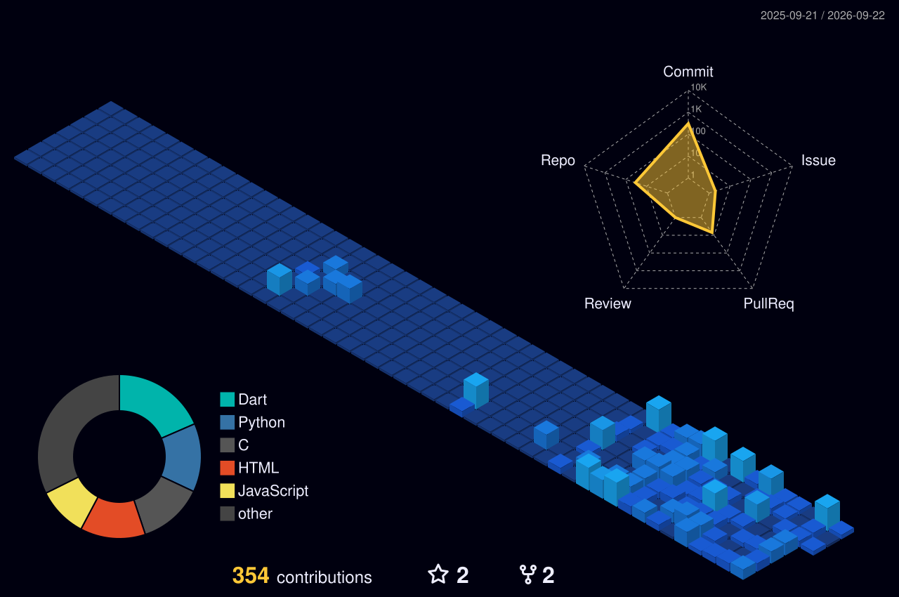

# 👋 Hi, I'm T. Raja Saranya

### 🚀 AI Full Stack Developer | 🤖 AI Explorer | 🛡️ Cybersecurity Enthusiast | ⚙️ AI Automation Engineer

🎓 B.Tech Information Technology Student

🚀 Founder of **MultiMax**

💡 Passionate about AI, Full Stack Development & Cybersecurity

🌍 Building products that solve real-world problems

⭐ Beyond Tech, Beyond Limit

---

# 🧑‍💻 About Me

<table>
<tr>

<td width="60%" valign="top">

<h2>👨‍💻 About Me</h2>

🎓 <strong>B.Tech Information Technology Student</strong> (2028)

💻 <strong>AI Full Stack Developer</strong>

⚙️ <strong>AI Automation Engineer</strong>

🤖 <strong>AI Explorer</strong>

🛡️ <strong>Cybersecurity Enthusiast</strong>

🚀 <strong>Founder of MultiMax</strong>

☁️ <strong>Learning Cloud Computing</strong>

🔐 <strong>Learning Ethical Hacking</strong>

📱 <strong>App Developer</strong>

🎮 <strong>Game Developer</strong>

🖥️ <strong>Software Developer</strong>

🎯 <strong>Goal:</strong> Build MultiMax into a global tech company

</td>

<td width="40%" align="center" valign="middle">

  

<h3>🚀 Building The Future</h3>

AI • Automation • Software • Security

 

  

</td>

</tr>
</table>

# 🛠️ Tech Stack
<!-- ========================================================= -->
<!--                    TECH STACK                            -->
<!-- ========================================================= -->

<h2 align="center">⚡ TECH STACK</h2>

  <b>Some of the technologies, tools and services with which I have extensive experience</b>

 

<!-- ================= PROGRAMMING ================= -->

<table align="center">
<tr>
<td colspan="6">

<h3>💻 Programming Languages</h3>

</td>
</tr>

<tr>

<td align="center">
 
<a href="https://www.python.org/">Python</a>
</td>

<td align="center">
 
<a href="https://en.cppreference.com/w/c">C</a>
</td>

<td align="center">
 
<a href="https://isocpp.org/">C++</a>
</td>

<td align="center">
 
<a href="https://www.java.com/">Java</a>
</td>

<td align="center">
 
<a href="https://developer.mozilla.org/en-US/docs/Web/JavaScript">JavaScript</a>
</td>

<td align="center">
 
<a href="https://www.typescriptlang.org/">TypeScript</a>
</td>

</tr>

<tr>

<td align="center">
 
<a href="https://go.dev/">Go</a>
</td>

<td align="center">
 
<a href="https://www.rust-lang.org/">Rust</a>
</td>

<td align="center">
 
<a href="https://www.gnu.org/software/bash/">Bash</a>
</td>

</tr>
</table>

 

<!-- ================= FRONTEND ================= -->

<table align="center">
<tr>
<td colspan="8">

<h3>🌐 Frontend Development</h3>

</td>
</tr>

<tr>

<td align="center">
 
<a href="https://react.dev/">React</a>
</td>

<td align="center">
 
<a href="https://nextjs.org/">Next.js</a>
</td>

<td align="center">
 
<a href="https://developer.mozilla.org/en-US/docs/Web/HTML">HTML5</a>
</td>

<td align="center">
 
<a href="https://developer.mozilla.org/en-US/docs/Web/CSS">CSS3</a>
</td>

<td align="center">
 
<a href="https://tailwindcss.com/">Tailwind CSS</a>
</td>

<td align="center">
 
<a href="https://getbootstrap.com/">Bootstrap</a>
</td>

<td align="center">
 
<a href="https://sass-lang.com/">SASS</a>
</td>

<td align="center">
 
<a href="https://mui.com/">MUI</a>
</td>

</tr>

<tr>

<td align="center">
 
<a href="https://ui.shadcn.com/">Shadcn UI</a>
</td>

<td align="center">
 
<a href="https://www.figma.com/">Figma</a>
</td>

</tr>
</table>

 

<!-- ================= BACKEND ================= -->

<table align="center">
<tr>
<td colspan="8">

<h3>⚙️ Backend Development</h3>

</td>
</tr>

<tr>

<td align="center">
 
<a href="https://nodejs.org/">Node.js</a>
</td>

<td align="center">
 
<a href="https://expressjs.com/">Express.js</a>
</td>

<td align="center">
 
<a href="https://www.python.org/">Python</a>
</td>

<td align="center">
 
<a href="https://www.djangoproject.com/">Django</a>
</td>

<td align="center">
 
<a href="https://flask.palletsprojects.com/">Flask</a>
</td>

<td align="center">
 
<a href="https://fastapi.tiangolo.com/">FastAPI</a>
</td>

<td align="center">
 
<a href="https://graphql.org/">GraphQL</a>
</td>

<td align="center">
 
<a href="https://laravel.com/">Laravel</a>
</td>

</tr>
</table>

 

<!-- ================= DATABASE ================= -->

<table align="center">
<tr>
<td colspan="8">

<h3>🗄️ Databases & Caching</h3>

</td>
</tr>

<tr>

<td align="center">
 
<a href="https://www.mysql.com/">MySQL</a>
</td>

<td align="center">
 
<a href="https://www.postgresql.org/">PostgreSQL</a>
</td>

<td align="center">
 
<a href="https://www.mongodb.com/">MongoDB</a>
</td>

<td align="center">
 
<a href="https://redis.io/">Redis</a>
</td>

<td align="center">
 
<a href="https://mariadb.org/">MariaDB</a>
</td>

<td align="center">
 
<a href="https://www.sqlite.org/">SQLite</a>
</td>

<td align="center">
 
<a href="https://supabase.com/">Supabase</a>
</td>

<td align="center">
 
<a href="https://firebase.google.com/">Firebase</a>
</td>

</tr>
</table>

 

<!-- ================= AI / ML ================= -->

<table align="center">
<tr>
<td colspan="6">

<h3>🤖 AI & Machine Learning</h3>

</td>
</tr>

<tr>

<td align="center">
 
Python
</td>

<td align="center">
 
TensorFlow
</td>

<td align="center">
 
PyTorch
</td>

<td align="center">
 
OpenCV
</td>

</tr>
</table>

 

<!-- ================= TOOLS ================= -->

<table align="center">
<tr>
<td colspan="8">

<h3>🛠️ Tools & Services</h3>

</td>
</tr>

<tr>

<td align="center">
 
<a href="https://git-scm.com/">Git</a>
</td>

<td align="center">
 
<a href="https://github.com/">GitHub</a>
</td>

<td align="center">
 
<a href="https://www.docker.com/">Docker</a>
</td>

<td align="center">
 
Kubernetes
</td>

<td align="center">
 
<a href="https://www.postman.com/">Postman</a>
</td>

<td align="center">
 
VS Code
</td>

<td align="center">
 
Linux
</td>

<td align="center">
 
Nginx
</td>

</tr>
</table>

 

<!-- ================= CLOUD ================= -->

<table align="center">
<tr>
<td colspan="8">

<h3>☁️ Cloud & DevOps</h3>

</td>
</tr>

<tr>

<td align="center">
 
AWS
</td>

<td align="center">
 
Google Cloud
</td>

<td align="center">
 
Azure
</td>

<td align="center">
 
Cloudflare
</td>

<td align="center">
 
Vercel
</td>

<td align="center">
 
Netlify
</td>

<td align="center">
 
Terraform
</td>

<td align="center">
 
Jenkins
</td>

</tr>
</table>

 

<!-- ================= CYBERSECURITY ================= -->

<table align="center">
<tr>
<td colspan="6">

<h3>🛡️ Cybersecurity</h3>

</td>
</tr>

<tr>

<td align="center">
 
Kali Linux
</td>

<td align="center">
 
Linux
</td>

<td align="center">
 
Bash
</td>

<td align="center">
 
Docker
</td>

<td align="center">
 
Nginx
</td>

</tr>
</table>

 

<!-- ================= FOOTER ================= -->

-----

# 🚀 Featured Projects

| Project | Description |
|---------|-------------|
| 🌍 EcoMind AI | Carbon footprint awareness platform |
| 🤖 AI Alert Analyst | AI-powered SOC security triage assistant |
| 📱 Werzex | Social media application |
| ☕ CoffeeHome | Coffee ordering application |
| 🛒 MultiMax Food | Food delivery application |
| 🎬 Multiflix | Movie streaming UI |
| 🎌 AnimeVerse | Anime discovery website |

---

# 📈 GitHub Analytics

 

---

# 📊 Detailed Analytics

 

 

---

# 📈 GitHub Activity Graph

---
## 🏙️ 3D GitHub Contribution

  

# 🐍 Contribution Snake

 

---

<!-- ================= CONTRIBUTION GRAPH ================= -->

<h2>🎮 Contribution Arcade</h2>

  

## 👀 Profile Views

  

<!-- ================= END CONTRIBUTION GRAPH ================= -->

# 📫 Connect With Me

---

### ⭐ Beyond Tech, Beyond Limit

### 🚀 Founder of MultiMax

